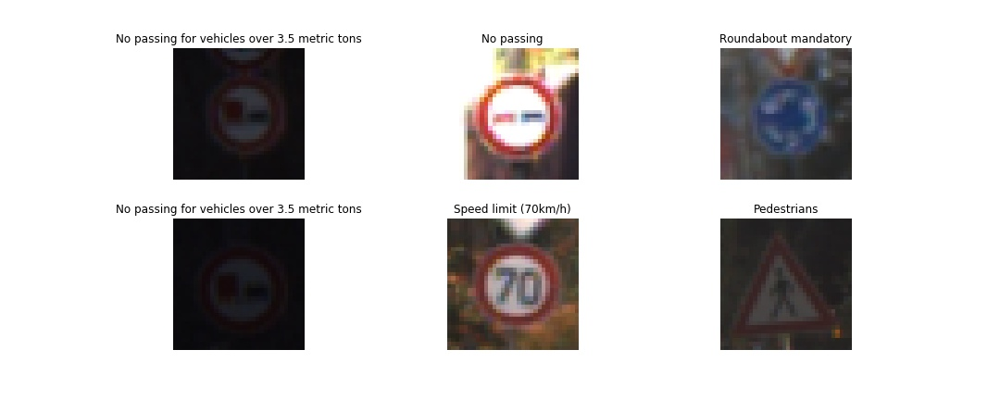
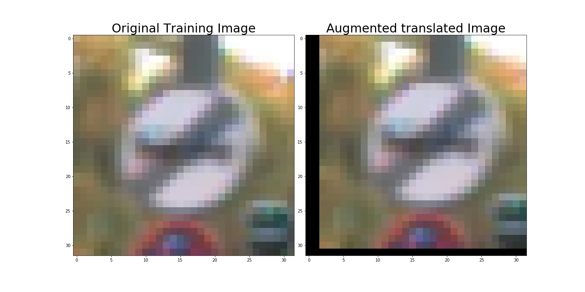
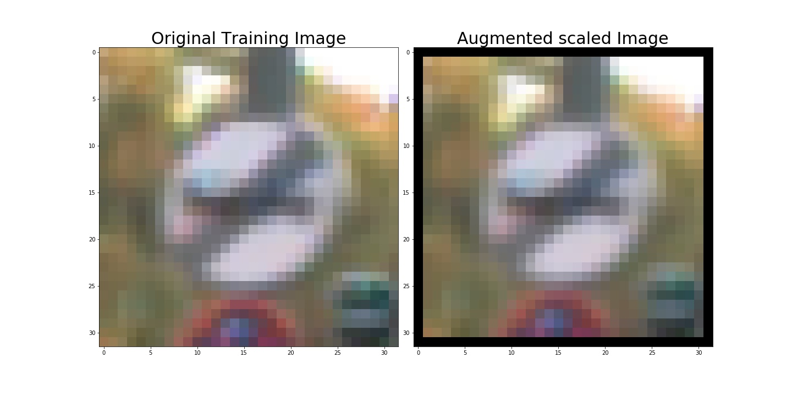
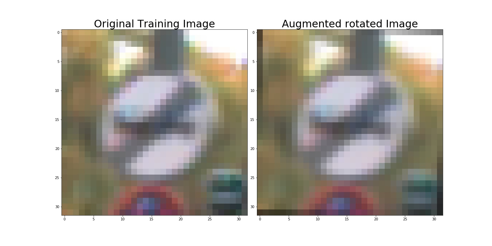
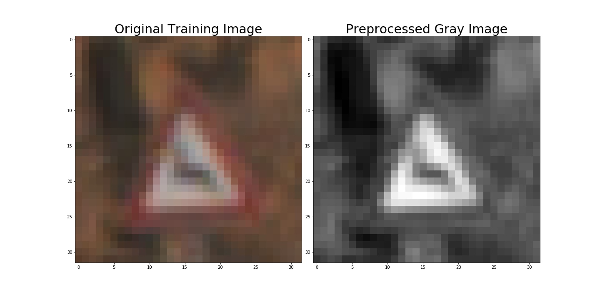
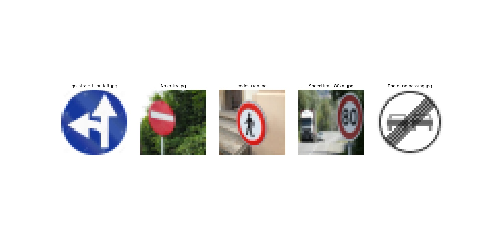
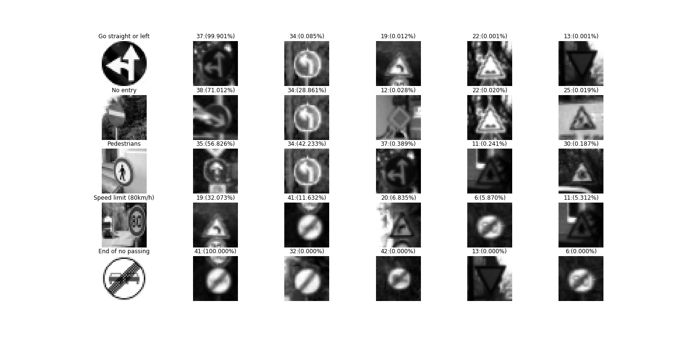

# **Traffic Sign Recognition** 
---

**Build a Traffic Sign Recognition Project**

The goals / steps of this project are the following:
* Load the data set (see below for links to the project data set)
* Explore, summarize and visualize the data set
* Design, train and test a model architecture
* Use the model to make predictions on new images
* Analyze the softmax probabilities of the new images
* Summarize the results with a written report

For this implementation, the [German Traffic Sign dataset](http://benchmark.ini.rub.de/?section=gtsrb&subsection=dataset) was used. This dataset was provided by udacity.

[//]: # (Image References)

[image1]: ./examples/visualization.jpg "Visualization"
[image2]: ./examples/grayscale.jpg "Grayscaling"
[image3]: ./examples/random_noise.jpg "Random Noise"
[image4]: ./examples/placeholder.png "Traffic Sign 1"
[image5]: ./examples/placeholder.png "Traffic Sign 2"
[image6]: ./examples/placeholder.png "Traffic Sign 3"
[image7]: ./examples/placeholder.png "Traffic Sign 4"
[image8]: ./examples/placeholder.png "Traffic Sign 5"

## Rubric Points
Here I will consider the [rubric points](https://review.udacity.com/#!/rubrics/481/view) individually and describe how I addressed each point in my implementation. The code of my implementation can be found in the Jupyter notebook [My_P2](https://github.com/JKWalleiee/CarND-Traffic-Sign-Classifier-Project/blob/master/Traffic_Sign_Classifier.ipynb). From now on, whenever the notebook is referenced, the following notation will be used: in [No].

---
### Data Set Summary & Exploration

#### 1. Provide a basic summary of the data set. In the code, the analysis should be done using python, numpy and/or pandas methods rather than hardcoding results manually.

I used the Python and Numpy libraries to calculate summary statistics of the traffic
signs data set:

* The size of training set is 34799
* The size of the validation set is 4410
* The size of test set is 12630
* The shape of a traffic sign image is (32, 32, 3) (RGB)
* The number of unique classes/labels in the data set is 43

#### 2. Include an exploratory visualization of the dataset.

Here is an exploratory visualization of the data set. It pulls in a random set of six images and labels them with the correct names in reference with the csv file to their respective id's.

After this point, I also detail the data set through a bar graph that shows how the data is distributed through the different labels.

Analyzing the histogram of the training data, it can be observed that the average number of training examples per class is 809, the minimum is 180 and the maximum 2010, hence some labels are one order of magnitude more abundant than others. This imbalance between classes could be a problem for the training, therefore a possible solution is presented at a later stage.

### Design and Test a Model Architecture

#### 1. Describe how you preprocessed the image data. What techniques were chosen and why did you choose these techniques? Consider including images showing the output of each preprocessing technique. Pre-processing refers to techniques such as converting to grayscale, normalization, etc. (OPTIONAL: As described in the "Stand Out Suggestions" part of the rubric, if you generated additional data for training, describe why you decided to generate additional data, how you generated the data, and provide example images of the additional data. Then describe the characteristics of the augmented training set like number of images in the set, number of images for each class, etc.)

As a first step, I decided to generate additional data because augmenting the training set might help improve model performance. In theory, the more data is available for each class in the training dataset, the less likely it is that overfitting occurs in the clasifier. The methods and the process to increase the data could be found In the step 1.2 "Augment the Data" (in [7-11]). The goal in this step is to double the number of images per class in the training dataset.

To add more data to the data set, I used three random affine transformation in the image. A affine transformation refers to the transformations that do not alter the parallelism of the lines, in this implementation, the transformations used corresponds to: rotation, translation and scaling. Through these transformations, the effect of viewing the sign from different angles and different distances is simulated.

Below is an example of each of these three transformations:

The augmented training set has 69598 images. Here is bar graph that shows how the the augmented training set is distributed through the different labels.

 

In addition to increasing the data, in this implementation the affine transformations were used to carry out a balancing of the training set, increasing the amount of images in the classes lacking data to an average value of all the classes. Below is a bar graph that shows how the the balanced training set is distributed through the different labels.

 

In the previous histogram, it can be observed that the minimum number of images per class is 1618 images, and the total number of images of the dataset is 93428.

After balancing the training data, I decided to convert the images to grayscale because many signs have similar color patterns and hence, no real advantage would come from using the RGB scale in some cases. This observation is based on the results obtained in this report (94.54%) and on the paper provided in the workspace of the project [baseline paper](http://yann.lecun.com/exdb/publis/pdf/sermanet-ijcnn-11.pdf) (99,17%), where the best results were obtained by ignoring color information.

In addition, in the preprocessing a normalization is applied to the image data, so that the data have an average of zero (approximately). This is done through the equation: (pixel - 128) / 128. This process of normalization is done because a wide distribution in the data could make it more difficult the process of optimization of the parameters in the training of the classifier.

The code of the preprocessing step could be found in the notebook [in 21-23]. Here is an example of a traffic sign image before and after the pre-processing step.

#### 2. Describe what your final model architecture looks like including model type, layers, layer sizes, connectivity, etc.) Consider including a diagram and/or table describing the final model.

My final model consisted of the following layers:

| Layer         		|     Description	        					| 
|:---------------------:|:---------------------------------------------:| 
| Input         		| 32x32x1 GrayScale image   							| 
| Convolution 5x5     	| 1x1 stride, Valid padding, outputs 28x28x6 	|
| RELU					|												|
| Max pooling	      	| 2x2 stride,  outputs 14x14x6 				|
| Convolution 5x5     	| 1x1 stride, Valid padding, outputs 10x10x16 	|
| RELU					|												|
| Max pooling	      	| 2x2 stride,  outputs 5x5x16 				|
| Fully connected		| input 400, output 120      									|
| RELU					|												|
| Dropout					|					50% keep (Train)							|
| Fully connected		| input 120, output 84      									|
| RELU					|												|
| Fully connected		| input 84, output 43      									|
|						|												|
|						|												|
 

#### 3. Describe how you trained your model. The discussion can include the type of optimizer, the batch size, number of epochs and any hyperparameters such as learning rate.

My final classifier was trained using:
-	AdamOptimizer to optimization of the hyperparameters
-	Batch size of 64
- Epoch: 20
-	Dropout rate of 50% (training) for regularization
-	Learning rate with [exponential decay]( https://www.tensorflow.org/api_docs/python/tf/train/exponential_decay):
o	Initial learning rate of 0.005
o	Decay rate of 0.99
o	Decay step of “batch size”
For the initialization of the model hyperparameters I used a normal distribution with mean of 0 and standard deviation of 0.1.

#### 4. Describe the approach taken for finding a solution and getting the validation set accuracy to be at least 0.93. Include in the discussion the results on the training, validation and test sets and where in the code these were calculated. Your approach may have been an iterative process, in which case, outline the steps you took to get to the final solution and why you chose those steps. Perhaps your solution involved an already well known implementation or architecture. In this case, discuss why you think the architecture is suitable for the current problem.

To train the model, I started from a a well known architecture (LeNet) because of simplicity of implementation and because it performs well on recognizing handwritings images, as observed in the course of Udacity. Initially , I performed a first training with the architecture without changes and the following parameters:

-Epochs: 10

-Batch size: 128

-Learning rate (static): 0.001

In this first training the normalization of the images, in grayscale, was done with the equation: (img / 255). My initial results showed that the model tended to overfit to the original training set, the accuracy of the training set was high but the accuracy of the valid set was less than the desired percentage. For this reason, I modified the normalization to (img-128/128), and adjust the training parameters:

- Epochs: 20

- Batch size: 64

- Learning rate (static): 0.001

With these changes, the accuracy of the validation set increased, but still not reached the desired percentage, therefore, I performed a third training, adding a dropout method. Initially, I use a keep probability of 75 % for the dropout, but after some tests I used a final value of 50%.

By adding the dropout, the efficiency of the classifier exceeded the desired percentage, however, I decided to perform an additional test, adding an exponential decay to the learning rate. Taking into account the theory of [Adam] (), this technique already has a decay rate, however I decided to add this additional rate decay, with an initial learning rate of 0.005, and the results were satisfactory.

As the last step of training, I augmented and balanced the training data and retrain my network, reaching a validation percentage of (). On the notebbok you can find the CNN code (in) and the code for training, validation and testing (in [])

Below is a table with the summary of the steps taken for training the neural network

| Training  |   Validation Accuracy  |
|----------------------------------------------------------------------------------------------------------------|----------|
| Epochs: 10 Batch size: 128 Learning rate (static): 0.001  |  90.9% |
| Epochs: 20 Batch size: 64 Learning rate(static): 0.001 |   92.7% |
| Epochs: 20 Batch size: 64 Learning rate (static): 0.001 |   94.5% |
| Epochs: 20 Batch size: 64 Learning rate (static): 0.001 Dropout (50 %) |   95.6% |
| Epochs: 20 Batch size: 64 Learning rate (Decay rate): 0.005 Dropout (50 %) | 96.31% |
| Augmented and balanced training set Epochs: 20 Batch size: 64 Learning rate (Decay rate): 0.005 Dropout (50 %)| 96.64% |

Accuracy Model On Training Images: 98.23
Accuracy Model On Validation Images: 96.64
Accuracy Model On Test Images: 94.54

My final model results were:
* training set accuracy of 98.23%
* validation set accuracy of 96.64%
* test set accuracy of 94.54%

The accuracy of the classifier per class is presented below:

|  | Training | Validation | Testing |
|-------------------------------------------------------|----------|------------|--------------|
| 0:Speed limit (20km/h) | 95.36% | 80.00% | 70.0% |
| 1:Speed limit (30km/h) | 97.90% | 97.08% | 97.1% |
| 2:Speed limit (50km/h) | 97.36% | 96.25% | 95.9% |
| 3:Speed limit (60km/h) | 97.78% | 100.00% | 94.0% |
| 4:Speed limit (70km/h) | 98.87% | 99.05% | 95.2% |
| 5:Speed limit (80km/h) | 97.58% | 93.81% | 91.7% |
| 6:End of speed limit (80km/h) | 98.95% | 100.00% | 92.7% |
| 7:Speed limit (100km/h) | 96.74% | 95.33% | 88.2% |
| 8:Speed limit (120km/h) | 99.13% | 99.33% | 98.4% |
| 9:No passing | 98.79% | 98.00% | 99.4% |
| 10:No passing for vehicles over 3.5 metric tons | 99.47% | 100.00% | 98.8% |
| 11:Right-of-way at the next intersection | 98.03% | 98.67% | 93.3% |
| 12:Priority road | 99.21% | 100.00% | 98.0% |
| 13:Yield | 99.79% | 99.17% | 99.4% |
| 14:Stop | 99.38% | 100.00% | 97.8% |
| 15:No vehicles | 99.51% | 100.00% | 98.1% |
| 16:Vehicles over 3.5 metric tons prohibited | 99.20% | 96.67% | 99.3% |
| 17:No entry | 99.75% | 98.33% | 97.2% |
| 18:General caution | 97.31% | 95.00% | 79.7% |
| 19:Dangerous curve to the left | 98.70% | 100.00% | 100.0% |
| 20:Dangerous curve to the right | 97.03% | 75.00% | 90.0% |
| 21:Double curve | 95.80% | 81.67% | 87.8% |
| 22:Bumpy road | 97.84% | 100.00% | 85.8% |
| 23:Slippery road | 96.48% | 96.67% | 98.0% |
| 24:Road narrows on the right | 97.71% | 90.00% | 96.7% |
| 25:Road work | 98.70% | 97.33% | 92.9% |
| 26:Traffic signals | 96.60% | 95.00% | 93.3% |
| 27:Pedestrians | 98.70% | 100.00% | 51.7% |
| 28:Children crossing | 96.85% | 100.00% | 99.3% |
| 29:Bicycles crossing | 95.49% | 93.33% | 95.6% |
| 30:Beware of ice/snow | 96.91% | 98.33% | 59.3% |
| 31:Wild animals crossing | 98.70% | 100.00% | 98.1% |
| 32:End of all speed and passing limits | 99.13% | 100.00% | 100.0% |
| 33:Turn right ahead | 99.57% | 94.44% | 100.0% |
| 34:Turn left ahead | 97.78% | 98.33% | 98.3% |
| 35:Ahead only | 99.49% | 98.33% | 93.8% |
| 36:Go straight or right | 97.96% | 100.00% | 100.0% |
| 37:Go straight or left | 98.27% | 100.00% | 100.0% |
| 38:Keep right | 99.35% | 100.00% | 94.6% |
| 39:Keep left | 98.83% | 100.00% | 98.9% |
| 40:Roundabout mandatory | 96.85% | 73.33% | 81.1% |
| 41:End of no passing | 98.21% | 40.00% | 83.3% |
| 42:End of no passing by vehicles over 3.5 metric tons | 97.90% | 90.00% | 100.0%</pre> |
When analyzing the above percentages, an interesting point to note is that the classes with low percentage (validation and test) correspond to the classes that initially lack images and were processed by a rolling step, that is, classes where where a large part of the data in the final training data set are images augmented by code.

In this section of the report, I had planned to show the complete confusion matrix, however, a 43x43 matrix contains a lot of information, and its analysis goes beyond the scope of this project. Instead, I decided to use the next stage of the report, "Test a Model on New Images", to analyze some of the classes with low accuracy in the validation and tests sets.

### Test a Model on New Images

#### 1. Choose five German traffic signs found on the web and provide them in the report. For each image, discuss what quality or qualities might be difficult to classify.

For this section of the report, I selected the five new images taking into account the following considerations:
- An image with low accuracy of validation and test (End of no passing).
- An image with very low accuracy test (Pedestrians).
- Three random images with high accuracy of test and validation.

Here are five German traffic signs that I found on the web:

These images may be challenging to classify because:

•	The first three images include much more background than the training images
•	The pedestrian image has a circular shape, but the training pedestrian images have triangular shapes
•	Contains image artifacts such as jpeg compression problems and copyright trademarks

Since these images are not in the right shape accepted by the classifier they were resized using opencv methods.

#### 2. Discuss the model's predictions on these new traffic signs and compare the results to predicting on the test set. At a minimum, discuss what the predictions were, the accuracy on these new predictions, and compare the accuracy to the accuracy on the test set (OPTIONAL: Discuss the results in more detail as described in the "Stand Out Suggestions" part of the rubric).

My model only correctly classified the "End of no passing" and "Go straight or left" images, therefore, I obtained an accuracy (with the new images) of 40%. Below is the classes that my model predicted for the new images.

| True label | Result label |
|:--------------------:|:---------------------------:|
| Go straight or left | Go straight or left |
| No entry | Keep right |
| Pedestrians | Ahead only |
| Speed limit (80km/h) | Dangerous curve to the left |
| End of no passing | End of no passing</pre> |

These results are lower than the accuracy on the test set, however, analyzing the classes where my model gave an incorrect prediction, it is observed that the initial assumption that the background could bring problems to my model is correct. A more detailed analysis is made in the next section.

#### 3. Describe how certain the model is when predicting on each of the five new images by looking at the softmax probabilities for each prediction. Provide the top 5 softmax probabilities for each image along with the sign type of each probability. (OPTIONAL: as described in the "Stand Out Suggestions" part of the rubric, visualizations can also be provided such as bar charts)

The method for making the predictions can be found in the notebook (in []), and the cells where the predictions were made for the new images are in ([]). Below are the top 5 softmax probabilities for each image:

For the first (Go straight or left) image, the model is sure that is a "Go straight or left" image, with an accuracy of 99.90 %. 
For the first image, the model is relatively sure that this is a stop sign (probability of 0.6), and the image does contain a stop sign. The top five soft max probabilities were

| Probability         	|     Prediction	        					| 
|:---------------------:|:---------------------------------------------:| 
| .60         			| Stop sign   									| 
| .20     				| U-turn 										|
| .05					| Yield											|
| .04	      			| Bumpy Road					 				|
| .01				    | Slippery Road      							|

For the second image ... 

### (Optional) Visualizing the Neural Network (See Step 4 of the Ipython notebook for more details)
#### 1. Discuss the visual output of your trained network's feature maps. What characteristics did the neural network use to make classifications?

